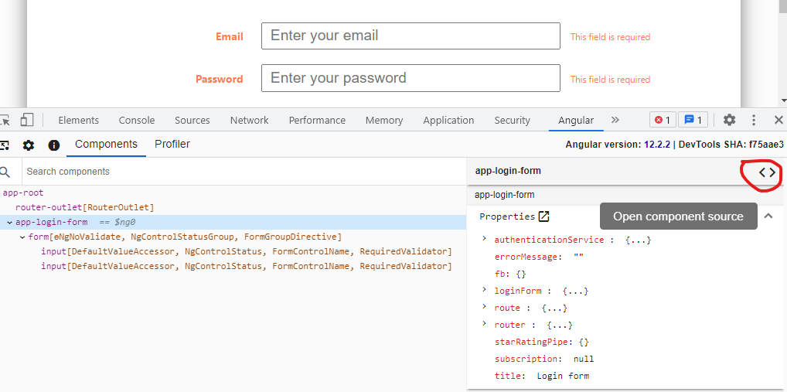
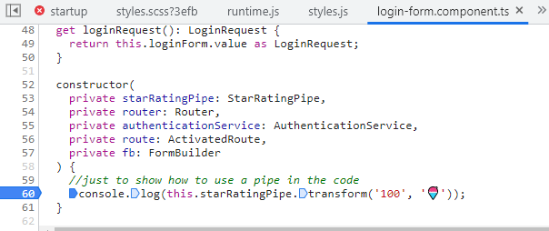
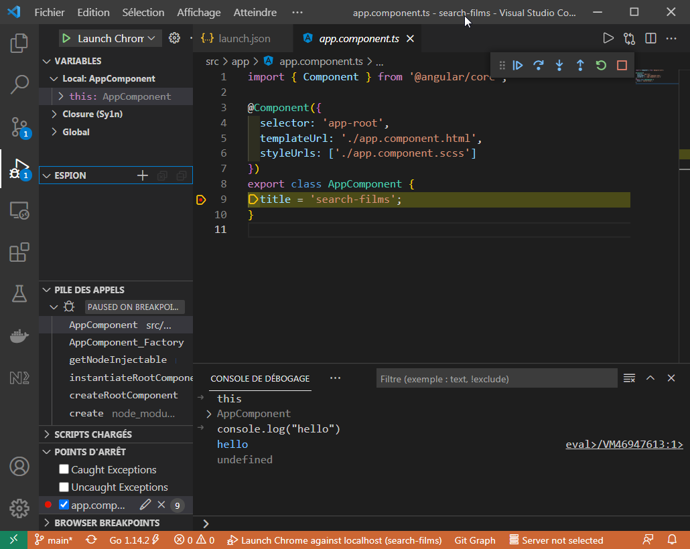

# Debugging
#### Debug with your browser's Developer Tools
The Developer Tools can be invoked by pressing F12 on your keyboard and offer a panel of features such as a JS console, network request traces and so on. 

The *Sources* tab of the Developer Tools enable you to open any source file by name (Ctrl + P) as long as you are not in a production build where files are minified. This is where you can place breakpoints.

Alternatively, Angular provides a browser extension for Chrome called [Angular DevTools](https://angular.io/guide/devtools). It adds Angular specific debugging and profiling capabilities. The following screenshot illustrates the component tree feature of Angular DevTools. When the developer clicks on the "<>" button surrounded in red, he gets access to the source code of the component where he can place breakpoints.





#### Debug with VSCode (only for locally served application)
VSCode allows you to natively debug your development application on Chrome or Edge. To do that, you first need to create a launch configuration for debugging. VSCode can create such a file automatically by following these steps:

- Press *F5* on your keyboard or clic on *create a launch.json file* in the debug panel (left sidebar).
- After a quick scan of the projet, VSCode will suggest relevent debug configurations. Choose *Chrome*.
- A new file located in *.vscode/launch.json* will be created.
- Open that file and change the port from the default value to the one used by the development server (4200 is the common value).

Here is a sample *.vscode/launch.json*:

```json
{
  "version": "0.2.0",
  "configurations": [
    {
      "type": "pwa-chrome",
      "request": "launch",
      "name": "Launch Chrome against localhost",
      "url": "http://localhost:4200",
      "webRoot": "${workspaceFolder}"
    }
  ]
}
```

Once you have a launch configuration and a running development server, press *F5*. This will open your app in a new browser window and enable debugging features in VSCode. To verify that, please add a breakpoint in the app component and launch a debug session. The debugger should break on your breakpoint.



